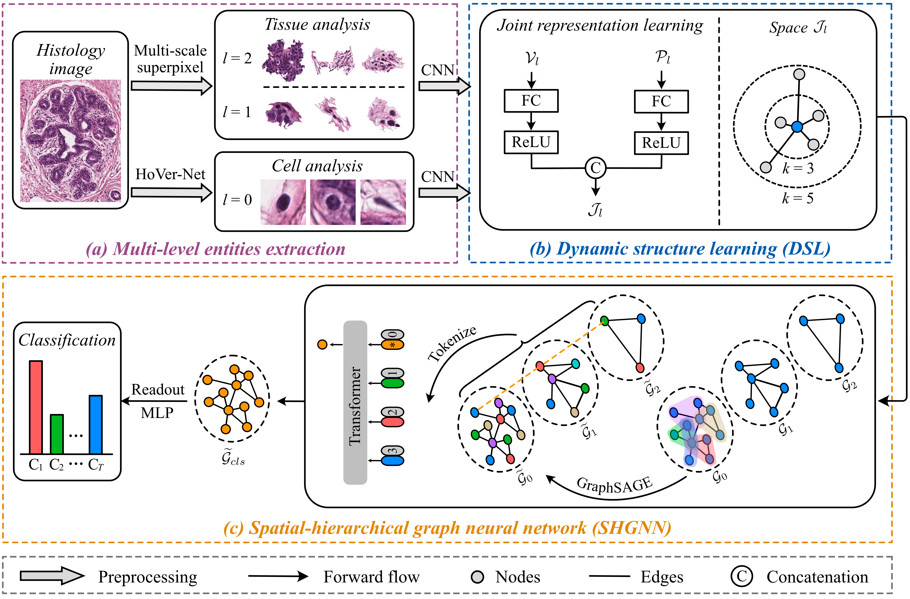

## Spatial-hierarchical Graph Neural Network with Dynamic Structure Learning for Histological Image Classification



## Installation
Clone the repo:
```bash
git clone https://github.com/HeLongHuang/SHGNN && cd SHGNN
```
Create a conda environment and activate it:
```bash
conda create -n env python=3.8
conda activate env
pip install -r requirements.txt
```

## Data Preprocess
***gendata.ipynb*** shows how to transform a histological image into the hierarchical graphs. After the data processing is completed, put all hierarchical graphs into a folder. The form is as follows:
```bash
Dataset
   ├── pyg_data_1.pkl
   ├── pyg_data_2.pkl
   :
   └── pyg_data_n.pkl
```
You also can download the processed graph data [here](https://cloud.189.cn/t/NziQRbUrAJju).The access code is:dei3

## Training
First, setting the data splits and hyperparameters in the file ***train.py***. Then, experiments can be run using the following command-line:
```bash
cd train
python train_<experiments>.py
```
The trained model will be saved in the folder ***SavedModels***. 

## Saved models
For each dataset, we provide a 3-fold checkpoint performing as:
| Dataset | Macro AUC |
| ----- |:--------:|
| CRCS   | 96.15 |
| BRACS | 95.06 |


## Inference
Using the following command-line for model inference and result statistics:
```bash
cd inference
python inference_<experiments>.py
```


## More Info
- Our implementation refers the following publicly available codes. 
  - [Pytorch Geometric](https://github.com/pyg-team/pytorch_geometric)--Fey M, Lenssen J E. Fast graph representation learning with PyTorch Geometric[J]. arXiv preprint arXiv:1903.02428, 2019.
  - [Histocartography](https://github.com/histocartography/histocartography)--Jaume G, Pati P, Anklin V, et al. HistoCartography: A toolkit for graph analytics in digital pathology[C]//MICCAI Workshop on Computational Pathology. PMLR, 2021: 117-128.
  - [Hact-net](https://github.com/PushpakPati/hact-net)--Pati P, Jaume G, Foncubierta-Rodríguez A, et al. Hierarchical graph representations in digital pathology[J]. Medical image analysis, 2022, 75: 102264.
  - [ViT Pytorch](https://github.com/lukemelas/PyTorch-Pretrained-ViT)--Dosovitskiy A, Beyer L, Kolesnikov A, et al. An Image is Worth 16x16 Words: Transformers for Image Recognition at Scale[C]//International Conference on Learning Representations. 2020.

- Our in-house dataset (CRCS) cannot be made public due to the data use agreement and the protection of patients' privacy. 

- The BRACS dataset is available at:
  - [BRACS](https://www.bracs.icar.cnr.it/)--Brancati N, Anniciello A M, Pati P, et al. Bracs: A dataset for breast carcinoma subtyping in h&e histology images[J]. arXiv preprint arXiv:2111.04740, 2021.

- Results on BRACS with official data split:
  - Under the same experimental setup, we further validated our model on BRACS with official data split. The pretrained checkpoints of three random repeated experiments are provided, which performing as:

      | Metrics | Macro AUC | Weighted F1 |
      | :---: |:--------:|:--------:|
      | Average | 89.65  | 62.77 | 


## Citation
- If you found our work useful in your research, please consider citing our works(s) at:
```
TBD
```
